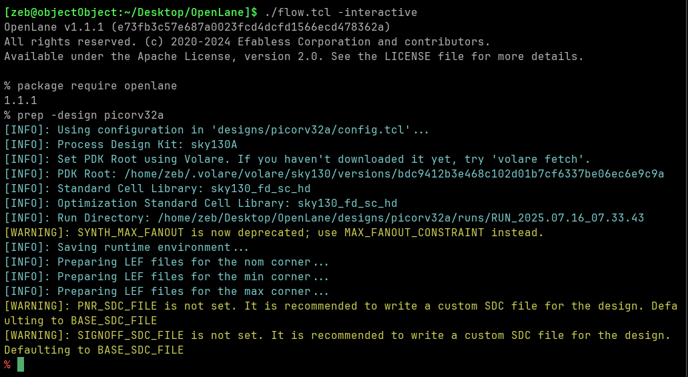
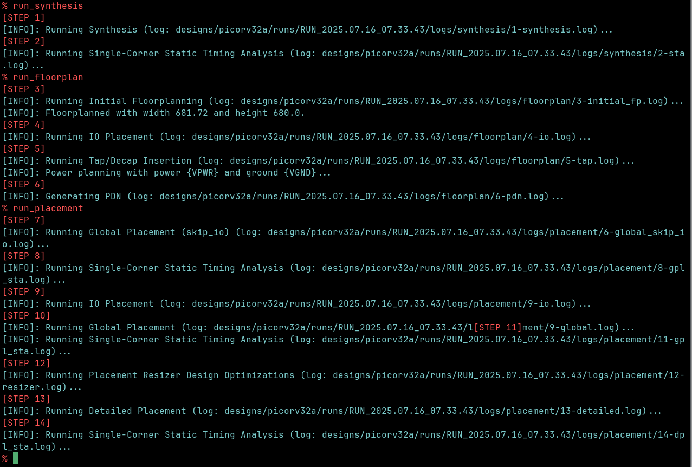
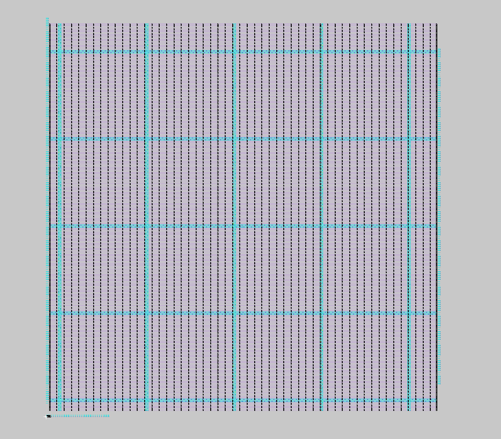
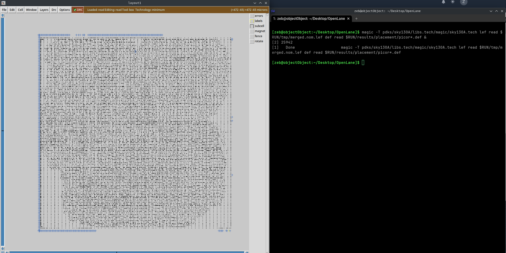
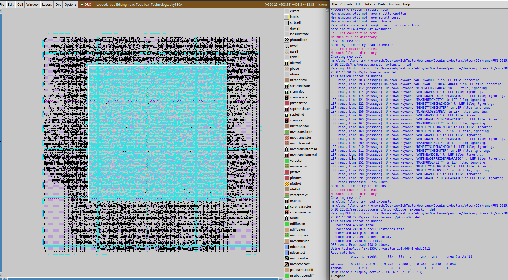
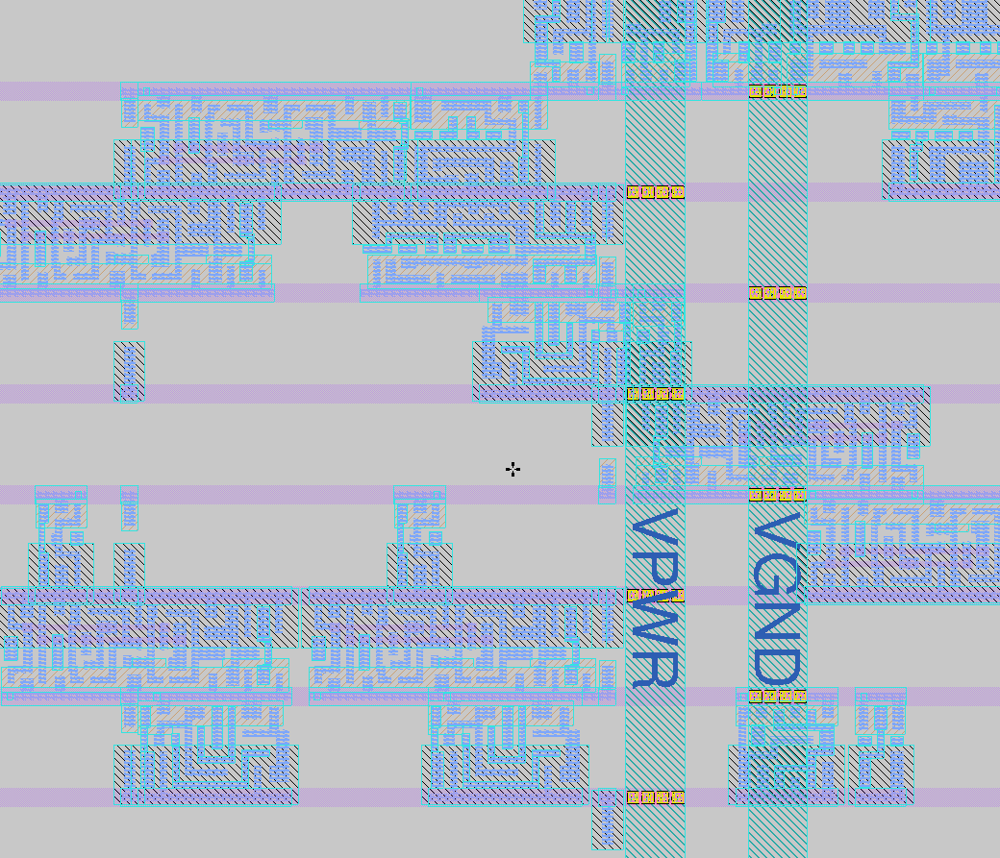
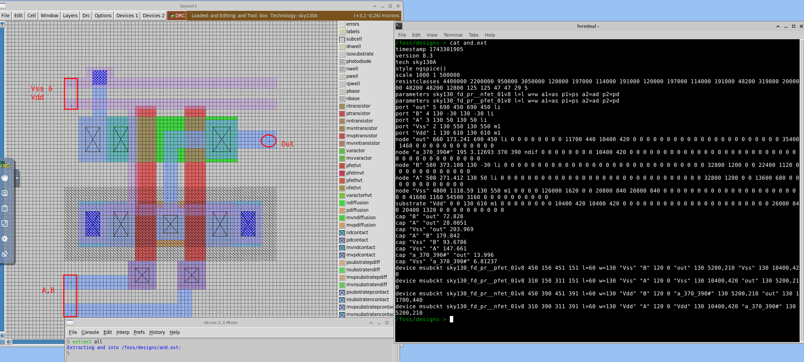
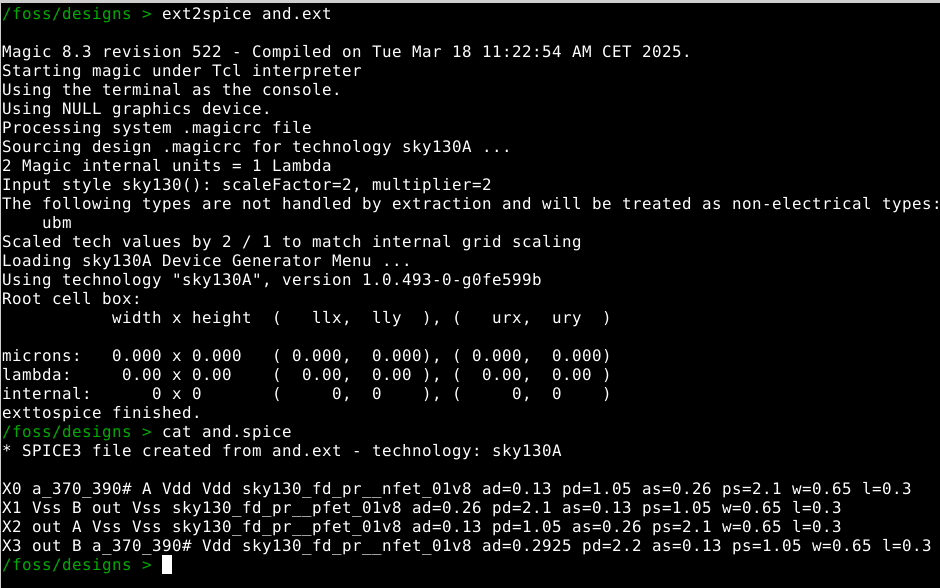
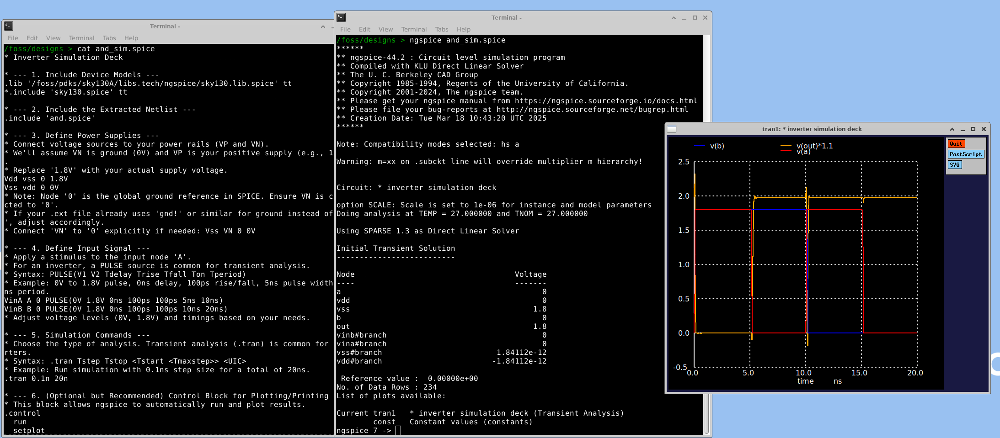

## Day 1

Begin by entering the environment (on my machine, via `nix develop`), and run `./flow.tcl -interactive`.

Now you are in OpenLane. Setup the design by running `package require openlane` and `prep -design picorv32a`.

The first three steps of the OpenLane flow: `run_synthesis, run_floorplan, run_placement`.

To view the output of the floorplan, you can use `magic`. In the tcl shell, run `magic -T $env(PDK_ROOT)/$env(PDK)/libs.tech/magic/$env(PDK).tech lef read $env(RUN_DIR)/tmp/merged.nom.lef def read $env(RUN_DIR)/results/floorplan/picorv32a.def &`.

**For some/most people, the file in the last command will be called `picorv32.def`, not `picorv32a.def`. Update the command accordingly.**

If you do not see the pink/blue lines, you have the wrong PDK path. Make sure you are using the correct relative location and that you spelled everything right, or just use the command I provided.

---

To view the output of the placement, simply modify the folder used in the `magic` command. Run  `magic -T $env(PDK_ROOT)/$env(PDK)/libs.tech/magic/$env(PDK).tech lef read $env(RUN_DIR)/tmp/merged.nom.lef def read $env(RUN_DIR)/results/placement/picorv32a.def &`.

**For some/most people, the file in the last command will be called `picorv32.def`, not `picorv32a.def`. Update the command accordingly.**

To examine the placement, zoom in and out with `z` and `shift+z`, respectively. Navigate laterally with arrow keys. To enter magic commands, type a `:` and then the command, then press enter. You will see what you type appear in the console below. To select an area, left click for one corner and then right click to set the other. Left clicking elsewhere will move your selection box.

Try out commands by typing `:expand` on a portion of the placement.

Expanded

Zoomed in

## Day 2

### Theory

$\text{utilization} = \frac{\text{netlist area}}{\text{core area}}$

The die is a slightly larger area of silicon that surrounds the core, essentially acting as a margin.

In order to more effecively place the combinational logic, logic is broken down into "blocks", which then get placed and layed out by the floorplan. These blocks will later be further detailed by other tools.

As the blocks are placed, they get surrounded with "decoupling capacitors," to stabilize the current draw that occurs during switching inside the blocks (CMOS gates only draw current when switching). This is to prevent voltage drops which would send the voltage of the digital ones into an "undefined" state, resulting in unintended or unknown behavior.

In order to mitigate "ground bounces" or "voltage drops" (when gnd increases or vdd drops), power is distributed in the chip through grided distribution wires with contacts at the intersections.

To maintain signal integrity over longer wire distances, repeaters must be placed. This also helps address the capacitance of the wire.

Propogation delay is $\text{time}_{\text{out threshold}} - \text{time}_{\text{in threshold}}$. Rise transition time is $\text{time}_{\text{slew low rise}} - \text{time}_{\text{slew high rise}}$, fall transition time is vice versa.

### Software

To modify the configuration of a design, alter `designs/[yourdesign]/config.tcl`. This does NOT have precedent over the PDK's `.tcl` file, however.

Cells are stored in the "cell library", which serves as a list of all cells and their characteristics - size, delay, voltage, inputs/outputs, etc. Placement tools then use this information when placing the standard cells.

## Day 3

Here is a standard cell (NAND) and its extracted netlist that I built for the Skywater PDK:

(the name of the file is wrong, it should be called `nand.ext`/`nand.mag`)

And its spice netlist:

And its simulated outputs:

(an LLM was used to generate `and_sim.spice`, the testbench)

